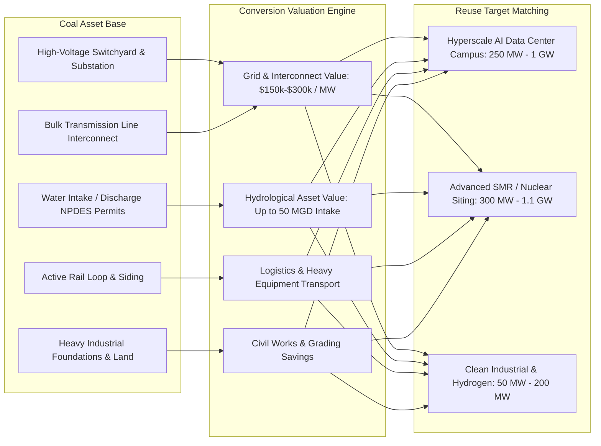

# Spec 04: Coal-to-Nuclear & Coal-to-Data-Center Conversion Engine

**Status:** Proposed  
**Priority:** High (Impact: 5/5, Size: 3/5, Completeness: 4/5)  
**Target Version:** v1.14.0  
**Lead Component:** `scripts/build_coal_conversions.py`, `connectors/coal_reindustrialization.py`, `docs/dc-score.js`, `docs/app.js`

---

## 1. Executive Summary & Value Proposition

Across the United States, the retirement of coal-fired generation (over 150 GW retired since 2010; another 75+ GW announced by 2030) represents the single largest transfer of heavy electrical and cooling infrastructure in modern history. Hyperscale data center developers (e.g. Google at Widows Creek AL, Aligned at Conesville OH, Amazon at Homer City PA) and advanced reactor developers (e.g. TerraPower at Kemper/Naughton, Duke Energy at Belews Creek) are actively competing for these sites.

According to INL and DOE studies, repurposing retired coal infrastructure delivers **15% to 35% overnight capital expenditure savings** and cuts interconnection wait times from **4.5+ years to immediate/accelerated queue transfer** under FERC Order 2023 and ISO repowering rules.

This initiative implements a dedicated **Coal Conversion Engine** that quantifies the stranded asset value, queue-skip acceleration, switchyard capacity, and cooling water intake rights of retired and retiring coal plants mapped directly to adjacent brownfields.

---

## 2. Infrastructure Inventory & Asset Quantification



### 2.1 Reusable Asset Breakdown Matrix

| Asset Component | Legacy Coal Infrastructure | Repurposing for Nuclear (SMR/AP1000) | Repurposing for Data Center | Estimated CapEx Savings |
|---|---|---|---|---|
| **Grid Interconnect** | 138 kV – 765 kV switchyard, high-MVA transformers | Direct reuse for power injection (same capacity) | Direct reuse for load off-take (substation repowering) | **$25M – $120M** + 3-5 yr queue skip |
| **Cooling Water Intake** | River/lake intake cribs, pumps, discharge canals, NPDES permit | Secondary loop heat sink (replaces raw water construction) | Evaporative / hybrid cooling towers & chiller loops | **$15M – $45M** + 2 yr CWA permit skip |
| **Rail Spurs & Siding** | Heavy unit-train loop tracks (115-136 lb rail) | Delivery of reactor pressure vessels & heavy modules | Delivery of massive generator skids & transformers | **$8M – $20M** |
| **Land & Buffers** | 500 – 3,000+ acres with environmental buffer zone | Meets NRC 10 CFR 100 exclusion area boundary (EAB) | Campus expansion for multi-building DC clusters | **$10M – $50M** |
| **Civil & Foundations** | Geotechnical borings, turbine hall pilings, roads | Reusable non-safety grade administrative & warehouse space | Reusable heavy equipment pads and security perimeters | **$5M – $15M** |

---

## 3. Data Schema & Pipeline

### 3.1 Python Data Schema (`schema.py`)

```python
class CoalConversionAsset(BaseModel):
    model_config = ConfigDict(extra="forbid")
    
    eia_plant_id: int = Field(description="EIA Plant Code")
    plant_name: str
    utility_operator: str
    state: str = Field(min_length=2, max_length=2)
    county: str
    latitude: float
    longitude: float
    retired_year: Optional[int] = None
    planned_retirement_year: Optional[int] = None
    nameplate_coal_mw: float = Field(ge=0.0)
    switchyard_kv: float = Field(ge=0.0)
    has_rail: bool
    has_water_intake: bool
    intake_flow_gpm: Optional[float] = None
    npdes_permit_id: Optional[str] = None
    site_acreage: Optional[float] = None
    iso_rto: str
    queue_transfer_eligible: bool
    est_stranded_asset_value_usd: float
    conversion_suitability: Literal["nuclear_preferred", "datacenter_preferred", "dual_feasible"]
```

### 3.2 Spatial Linkage to Tracked Brownfields
Every coal plant in the dataset ($N \approx 550$ active/retired facilities) is joined to all 46,759 brownfields within a **10-mile radius** via `PointIndex`.

---

## 4. Scoring Algorithm & Financial Valuation Formulation

### 4.1 Asset Valuation Formula
For any candidate brownfield site $s$ linked to an adjacent coal asset $c$:

$$\text{Valuation}_{\text{total}}(s, c) = V_{\text{grid}}(c) + V_{\text{water}}(c) + V_{\text{rail}}(c) + V_{\text{civil}}(c)$$

Where:
- $V_{\text{grid}}(c) = \text{capacity\_mw}(c) \times \$180{,}000/\text{MW} \times \text{decay}(d(s, c))$
- $V_{\text{water}}(c) = \begin{cases} \$25{,}000{,}000 \times \text{decay}(d(s, c)) & \text{if water intake active} \\ 0 & \text{otherwise} \end{cases}$
- $V_{\text{rail}}(c) = \begin{cases} \$12{,}000{,}000 \times \text{decay}(d(s, c)) & \text{if rail siding present} \\ 0 & \text{otherwise} \end{cases}$
- $\text{decay}(d) = \exp(-0.25 \times d)$ where $d$ is distance in miles.

### 4.2 Queue-Skip Acceleration Score
Sites within 1.5 miles of a retired switchyard gain an immediate **Queue Advantage Badge** indicating eligibility for ISO/RTO generator replacement rules (e.g. PJM Section 49, MISO Attachment X, ERCOT Batch Zero), bypassing standard 5-year interconnection studies.

---

## 5. UI/UX Components

1. **"Coal Repowering" Overlay on Main Map**:
   - Distinctive icon (coal-to-clean repowering badge ⬢) with heat-map halo indicating switchyard capacity.
   - Clickable card showing MW capacity, switchyard voltage, historical water discharge, and estimated replacement cost savings.
2. **Coal Conversion Filter Preset**:
   - One-click filter in the header: **"⚡ Coal Repowering Candidates"** showing brownfields located within 3 miles of $\ge 250\text{ MW}$ retired or retiring coal plants.

---

## 6. Verification & Test Plan

- **Unit Tests (`tests/test_coal_conversions.py`)**:
  - Test valuation algorithm across small (100 MW), medium (500 MW), and mega (1,500+ MW) plants.
  - Verify zero negative valuation figures.
- **E2E Playwright Tests (`tests/e2e/test_coal_repowering.py`)**:
  - Test map overlay toggling, popup rendering, and filter preset application.
  - Verify detail panel displays accurate asset valuation breakdown.
