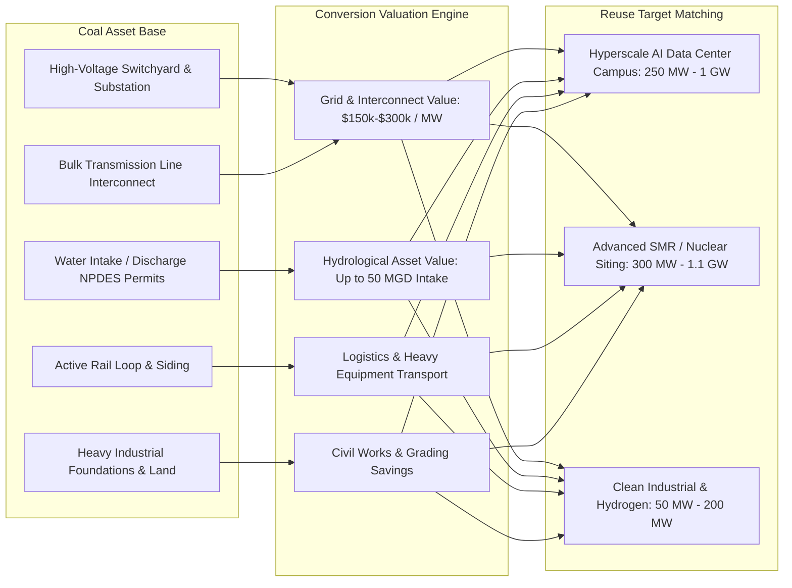

# Spec 04: Coal-to-Nuclear & Coal-to-Data-Center Conversion Engine

**Status:** v1 shipped 2026-08-23 (curated 18-plant catalog + proximity join + Coal Repowering tab); revised same day against the [2026-08 industry sweep](../../research/industry-topical-2026-08.md)  
**Priority:** High (Impact: 5/5, Size: 3/5, Completeness: 4/5)  
**Target Version:** v1.14.0  
**Lead Component:** `scripts/build_coal_conversions.py`, `docs/dc-score.js`, `docs/app.js`

---

## 1. Executive Summary & Value Proposition

Across the United States, the retirement of coal-fired generation (over 150 GW retired since 2010; another 75+ GW announced by 2030) represents the single largest transfer of heavy electrical and cooling infrastructure in modern history. Hyperscale data center developers (Google at Widows Creek AL, Aligned at Conesville OH, **Homer City Redevelopment + Kiewit at Homer City PA — a 4.5 GW gas campus with EQT supply, NOT an Amazon project**) and advanced reactor developers (TerraPower's Natrium at **Kemmerer** WY — NRC construction permit 2026-03-04, construction started 2026-04-23; Duke Energy at Belews Creek) are actively competing for these sites.

According to INL and DOE studies, repurposing retired coal infrastructure delivers **15% to 35% overnight capital expenditure savings** and can cut interconnection timelines dramatically by reusing an existing point of interconnection (see §4.2 for the correctly-named per-RTO mechanisms).

**Two 2026 realities the engine must model honestly** (per the Aug-2026 sweep):
1. **Retirement dates slip in both directions.** DOE has issued 43+ §202(c) emergency orders since May 2025 keeping announced-retirement coal units running (J.H. Campbell, Eddystone, Centralia…), and Colstrip went the other way entirely — NorthWestern Energy took 55% ownership on 2026-01-01 and signed data-center development agreements (Sabey/Atlas/Quantica, up to ~1,500 MW by 2030) that make it a *life-extension* asset, not a conversion candidate. A `planned_retirement_year` is a claim with a date and a source, never a fact.
2. **Bring-your-own-power reframes the asset.** ~56 GW of behind-the-meter generation is planned by DC developers (30% of planned builds); a coal site's gas lateral, water intake, and switchyard are as valuable for a *new BTM plant* as for grid supply.

This initiative implements a dedicated **Coal Conversion Engine** that quantifies the stranded asset value, queue-skip acceleration, switchyard capacity, and cooling water intake rights of retired and retiring coal plants mapped directly to adjacent brownfields.

---

## 2. Infrastructure Inventory & Asset Quantification



### 2.1 Reusable Asset Breakdown Matrix

| Asset Component | Legacy Coal Infrastructure | Repurposing for Nuclear (SMR/AP1000) | Repurposing for Data Center | Estimated CapEx Savings |
|---|---|---|---|---|
| **Grid Interconnect** | 138 kV – 765 kV switchyard, high-MVA transformers | Direct reuse for power injection (same capacity) | Direct reuse for load off-take (substation repowering) | **$25M – $120M** + 3-5 yr queue skip |
| **Cooling Water Intake** | River/lake intake cribs, pumps, discharge canals, NPDES permit | Secondary loop heat sink (replaces raw water construction) | Evaporative / hybrid cooling towers & chiller loops | **$15M – $45M** + 2 yr CWA permit skip |
| **Rail Spurs & Siding** | Heavy unit-train loop tracks (115-136 lb rail) | Delivery of reactor pressure vessels & heavy modules | Delivery of massive generator skids & transformers | **$8M – $20M** |
| **Land & Buffers** | 500 – 3,000+ acres with environmental buffer zone | Meets NRC 10 CFR 100 exclusion area boundary (EAB) | Campus expansion for multi-building DC clusters | **$10M – $50M** |
| **Civil & Foundations** | Geotechnical borings, turbine hall pilings, roads | Reusable non-safety grade administrative & warehouse space | Reusable heavy equipment pads and security perimeters | **$5M – $15M** |

---

## 3. Data Schema & Pipeline

### 3.1 Python Data Schema (`schema.py`)

```python
class CoalConversionAsset(BaseModel):
    model_config = ConfigDict(extra="forbid")
    
    eia_plant_id: Optional[int] = Field(default=None, description="EIA Plant Code — only when verified against EIA-860M; never hand-typed from memory")
    plant_name: str
    utility_operator: str
    state: str = Field(min_length=2, max_length=2)
    county: str
    latitude: float
    longitude: float
    status: Literal["operating", "retired", "planned_retirement", "converted_gas"]
    retired_year: Optional[int] = None
    planned_retirement_year: Optional[int] = None
    nameplate_coal_mw: float = Field(ge=0.0)
    switchyard_kv: float = Field(ge=0.0)
    has_rail: bool
    has_water_intake: bool
    intake_flow_gpm: Optional[float] = None   # only when a permit/EIS documents it; else None
    npdes_permit_id: Optional[str] = None      # only when verified in EPA ECHO; else None
    site_acreage: Optional[float] = None
    iso_rto: str                               # market label; "Non-RTO/WECC" etc. for bilateral West
    queue_transfer_eligible: bool              # derived: status != "operating" (an active plant's POI is not transferable)
    est_stranded_asset_value_usd: float        # MODELED (see §4.1) — always labeled as an estimate in UI
    conversion_suitability: Literal["nuclear_preferred", "datacenter_preferred", "dual_feasible"]
    note: Optional[str] = None                 # deal context (e.g. Colstrip life-extension, Kemmerer Natrium)
    source_url: str                            # REQUIRED per-row citation
    verified_at: str                           # REQUIRED YYYY-MM-DD; same audit discipline as STATE_DC_INCENTIVES
```

**Provenance contract (house rule, non-negotiable):** every curated row carries `source_url` +
`verified_at`, exactly like `STATE_DC_INCENTIVES` / `reference-campuses.json`. Fields that no public
document supports (intake GPM, NPDES IDs) stay `None` rather than being invented — "absent means
unverified" must survive into the UI. Re-audit cadence: **quarterly**, alongside
`STATE_DC_REGULATION` (retirement dates move monthly under §202(c) orders and DC-driven life
extensions).

### 3.2 Spatial Linkage to Tracked Brownfields
Every coal plant in the dataset is joined to all 46,759 brownfields within a **10-mile radius** via `PointIndex`.

### 3.3 The durable path: derive, don't curate (v2)
The v1 catalog is hand-curated (18 rows). The scale-out to the full universe (~550 plants) must
**derive** the derivable fields from the **EIA-860M workbook already cached by
`connectors/eia_retired_plants.py`** (cache key `51f37f3890e1b51e.bin`): plant id, lat/lon,
nameplate MW, retirement year/month, balancing authority — leaving only the reuse-asset fields
(rail loop, intake, switchyard kV, deal context) as analyst-verified overlays. A validator check
(`coal-catalog-eia-agreement`) cross-checks every curated row against the workbook whenever the
cache is present, so a hand-typed MW or retirement year can't silently drift from the federal
record. This mirrors the `ap1000-sites.json` pattern (infra fields joined from data, analyst fields
cited per-row).

---

## 4. Scoring Algorithm & Financial Valuation Formulation

### 4.1 Asset Valuation Formula
For any candidate brownfield site $s$ linked to an adjacent coal asset $c$:

$$\text{Valuation}_{\text{total}}(s, c) = V_{\text{grid}}(c) + V_{\text{water}}(c) + V_{\text{rail}}(c) + V_{\text{civil}}(c)$$

Where:
- $V_{\text{grid}}(c) = \text{capacity\_mw}(c) \times \$180{,}000/\text{MW} \times \text{decay}(d(s, c))$
- $V_{\text{water}}(c) = \begin{cases} \$25{,}000{,}000 \times \text{decay}(d(s, c)) & \text{if water intake active} \\ 0 & \text{otherwise} \end{cases}$
- $V_{\text{rail}}(c) = \begin{cases} \$12{,}000{,}000 \times \text{decay}(d(s, c)) & \text{if rail siding present} \\ 0 & \text{otherwise} \end{cases}$
- $\text{decay}(d) = \exp(-0.25 \times d)$ where $d$ is distance in miles.

### 4.2 Queue-Skip Acceleration Score
Sites within 1.5 miles of a retired switchyard gain an immediate **Queue Advantage Badge**. The
mechanisms must be named correctly per market (the v1 draft conflated them — corrected against the
Aug-2026 sweep):

| Market | POI-reuse mechanism (generation) | Expedite mechanism (new gen / large load) |
|---|---|---|
| PJM | **Surplus Interconnection Service** (FERC Order 845) + **generator Replacement process** | Reliability Resource Initiative (Dec 2024); **Expedited Interconnection Track** — FERC-approved 2026-06-09, accepting requests (≥500 MW capacity resources, state-sponsored, ≤10/yr, sunsets end-2027) |
| MISO | Generator Replacement + surplus study (shares existing POI/rights) | **ERAS** — Expedited Resource Addition Study (2025) |
| ERCOT | Serial "connect-and-manage" already fast for gen | **Batch Zero** is the first *large-load* study batch (PCLR / WLPUN designations) under the PUCT-approved Batch Study framework — a LOAD process, not a generator transfer rule. Classifications were due 2026-08-07 but **ERCOT paused Batch Zero** pending the Governor's large-load verification directive (as of Aug 2026). TX **SB6 (2025)** governs co-location. |
| All six RTOs | — | FERC **§206 show-cause orders (2026-06-18)** compel justification/reform of large-load interconnection rules (large load defined >50 MW at >69 kV); compliance filings land H2 2026 — track in Spec 09 |

The badge copy should say "generator-replacement / surplus-interconnection eligible (retired or
retiring POI)" — never a made-up tariff section number, and never for a still-operating plant.

---

## 5. UI/UX Components

1. **"Coal Repowering" Overlay on Main Map**:
   - Distinctive icon (coal-to-clean repowering badge ⬢) with heat-map halo indicating switchyard capacity.
   - Clickable card showing MW capacity, switchyard voltage, historical water discharge, and estimated replacement cost savings.
2. **Coal Conversion Filter Preset**:
   - One-click filter in the header: **"⚡ Coal Repowering Candidates"** showing brownfields located within 3 miles of $\ge 250\text{ MW}$ retired or retiring coal plants.

---

## 6. Verification & Test Plan

- **Unit Tests (`tests/test_coal_conversions.py`)**:
  - Test valuation algorithm across small (100 MW), medium (500 MW), and mega (1,500+ MW) plants.
  - Verify zero negative valuation figures.
  - Every row carries a non-empty `source_url` + ISO-date `verified_at` (provenance contract).
  - Status/year coherence: `retired` ⇒ `retired_year` set; `planned_retirement` ⇒ future year;
    `queue_transfer_eligible` false for `operating`.
- **Validator (`scripts/validate_data.py`)**:
  - `overlay-pydantic-schema` — the three coal/federal overlay files validate against their
    `schema.py` classes on every run (the classes must be *live*, not documentation).
  - `coal-catalog-eia-agreement` — cross-check MW / retirement year / coordinates against the
    cached EIA-860M workbook when present.
- **E2E Playwright Tests (`tests/e2e/test_coal_repowering.py`)**:
  - Test map overlay toggling, popup rendering, and filter preset application (filter `<option>`
    values must be derived from the dataset's actual value domain — the UAT-007 drift rule).
  - Verify detail panel displays the valuation labeled as a *modeled estimate*.
  - The tab must not break the first-paint DOM budget (5,000 nodes) or the mobile tab-strip
    overflow guarantee (`documentElement.scrollWidth - clientWidth == 0` at 375px).

---

## 7. v1 ship notes & follow-ups (2026-08-23)

Shipped in the `feat/coal-repowering-and-arch-pipelines` PR: 18-plant curated catalog,
proximity join (10 mi, `PointIndex`), Coal Repowering tab (KPI deck, filterable table, drawer,
nearby-brownfields list), map ⬢ overlay, detail-panel row, provenance entry. Post-review fixes in
the same PR: corrected Kemmerer/Colstrip/Montour/Homer City rows per the sweep; per-row
`source_url`/`verified_at`; derived `queue_transfer_eligible`; status vocabulary gained
`converted_gas`; unverifiable intake/NPDES values nulled.

Open follow-ups, in priority order:
1. **[high] Derive the full ~550-plant universe from EIA-860M** (§3.3) instead of hand-curating.
2. **[med] Add the marquee rows the sweep surfaced** once derivable: Brandon Shores, Coal Creek
   (Applied Digital on-site), Intermountain (hydrogen CCGT repower + HVDC), San Juan, Sherco.
3. **[med] Score integration** — the engine is display-only today; fold `coal_conversion_*` into
   `_scoreGridReuse()`'s planned/retired pathways so the 614-site planned-retirement join and this
   catalog don't tell divergent stories.
4. **[low] BTM-siting view** — surface gas-lateral + water + acreage as a "build-your-own-power
   here" sub-score (T1 of the sweep).
