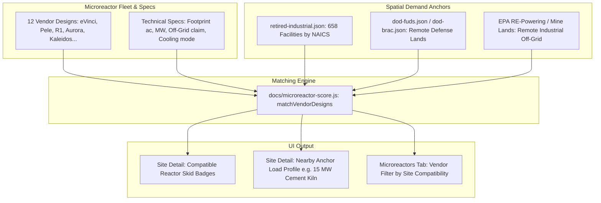

# Spec 07: Microreactor Demand Ladder to Asset-Cluster Spatial Join

**Status:** Proposed  
**Priority:** High (Impact: 4/5, Size: 2/5, Completeness: 5/5)  
**Target Version:** v1.15.0  
**Lead Component:** `docs/microreactor-score.js`, `docs/app.js`, `scripts/build_microreactor_fleet.py`

---

## 1. Executive Summary & Value Proposition

In v1.12.0, the platform shipped the **Microreactors** tab featuring:
- A curated vendor fleet (`docs/data/microreactor-fleet.json`: 12 vendors, 32 commitments, 8-sector / 55-class demand ladder).
- A 0–100 scoring lens (`docs/microreactor-score.js`) that deliberately inverts the grid proximity signal to favor isolated, off-grid, and high-reliability industrial/defense use cases.

However, as documented in `backlog.md`, **the 55-class demand ladder currently exists only as a reference table rather than a spatial join**. Furthermore, the tab lacks **vendor-to-site physical compatibility matching** (matching specific reactor dimensions, exclusion footprints, and off-grid claims to specific site geometries).

This specification resolves both gaps by:
1. **Spatially joining the demand ladder** to adjacent physical demand anchors on disk: 658 retired industrial facilities (cement plants 7–25 MW, metal smelters, chemical processing), remote DoD installations, mine sites, and critical infrastructure.
2. **Implementing deterministic vendor-fit matching** (e.g. Antares R1, Westinghouse eVinci, BWXT Pele, Radiant Kaleidos, Oklo Aurora) based on published footprint acreage, cooling water requirements, and transportability mode (standard ISO shipping container vs. heavy haul).

---

## 2. Demand Matching & Siting Logic



### 2.1 The 8-Sector Demand Match Matrix

| Sector | Example Load Classes | Typical MW Band | Nearest Proxy on Disk | Match Criteria |
|---|---|---|---|---|
| **Heavy Manufacturing** | Cement kilns, glass plants, pulp & paper | 7 – 25 MWe | `retired-industrial.json` NAICS 3273, 3221 | Proximity $\le 5\text{ mi}$, thermal host candidate |
| **Remote Mining** | Critical mineral extraction, heap leach, mill | 5 – 20 MWe | EPA RE-Powering Mining / AML | Off-grid ($>10\text{ mi}$ grid), high diesel displacement |
| **Defense / Expeditionary** | Tactical microgrids, radar stations, forward bases | 1 – 10 MWe | `dod-fuds.json`, `dod-brac.json` | Federal ownership, high isolation score |
| **Edge / AI Compute** | Modular data centers, remote inference nodes | 2 – 20 MWe | Superfund / Brownfield with fiber proximity | Low water stress, dry cooling compatible |
| **District Energy / Microgrid** | Islanded communities, municipal resilience | 3 – 15 MWe | High electric tariff counties, Alaska/island sites | Diesel displacement economics |

---

## 3. Data Schema & Contracts

### 3.1 Vendor Compatibility Contract (`docs/data/microreactor-fleet.json`)

```typescript
interface MicroreactorVendorFit {
  vendor_id: string;
  design_name: string;
  power_mwe: number;
  thermal_mwt: number;
  min_footprint_acres: number;
  transport_mode: 'iso_container_truck' | 'rail_heavy' | 'barge_only';
  cooling_type: 'ambient_air' | 'heat_pipe' | 'water_intake';
  off_grid_ready: boolean;
  licensing_pathway: 'NRC_Part_50_52' | 'NRC_Part_53' | 'DOE_Authorization';
  is_compatible: boolean;
  compatibility_notes: string[];
}
```

---

## 4. Scoring & UI Implementation

1. **Spatial Join in `microreactor-score.js`**:
   - Computes `nearest_industrial_load_mw` and `nearest_industrial_load_sector` from `retired-industrial.json`.
   - Replaces the generic power-plant proxy with direct NAICS-specific industrial demand quantification.
2. **Vendor Compatibility Cards in Detail Panel**:
   - When viewing a site in the Microreactors tab, renders a **"Compatible Reactor Deployments"** chip row:
     - e.g. `[✓ Westinghouse eVinci (5 MWe)]` `[✓ Antares R1 (10 MWe)]` `[✗ Oklo Aurora (Acreage < 5 ac)]`.
3. **Zero First-Paint DOM Impact**:
   - Compatible vendors are calculated in memory upon row selection, rendering inside the existing detail panel.

---

## 5. Verification & Test Plan

- **Unit Tests (`tests/test_microreactor_matching.py`)**:
  - Test that sites with $<2\text{ acres}$ flag Westinghouse eVinci as compatible (2 ac footprint) and Oklo Aurora as requiring site expansion.
  - Test off-grid filter matching against Haines Pol Dump and remote Alaska FUDS.
- **E2E Playwright Tests (`tests/e2e/test_microreactor_ui.py`)**:
  - Verify detail panel displays compatible vendor list with accurate electrical and thermal ratings.
