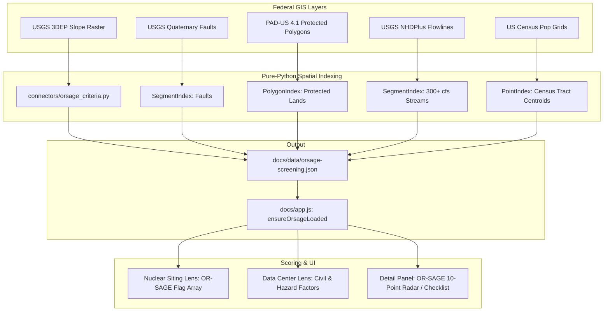

# Spec 03: ORNL OR-SAGE National Nuclear & Large-Load Siting Criteria Layer

**Status:** Proposed  
**Priority:** High (Impact: 5/5, Size: 4/5, Completeness: 4/5)  
**Target Version:** v1.14.0  
**Lead Component:** `connectors/orsage_criteria.py`, `docs/ap1000-score.js`, `docs/dc-score.js`, `docs/provenance.js`

---

## 1. Executive Summary & Value Proposition

Oak Ridge National Laboratory's **OR-SAGE** (Oak Ridge Siting Analysis for power Generation Expansion) is the gold-standard computational GIS framework utilized by the Department of Energy (DOE), Idaho National Laboratory (INL), and industry partners (e.g. Google, Elementl Power, Constellation) to screen candidate locations for advanced nuclear reactors, SMRs, and gigawatt-scale data center campuses.

Currently, our platform computes only 1 of the 10 official OR-SAGE exclusion/screening parameters (100-year floodplain via FEMA NFHL). This initiative implements the full **10-Parameter OR-SAGE Screening Suite** across all 46,759 sites in the corpus, elevating the platform's scientific rigor to match national laboratory standards.

Following the ORNL/DOE methodology, these parameters are modeled as **informative flags and risk adjustments**, rather than blunt exclusion gates, empowering users to evaluate site-specific engineering mitigations.

---

## 2. The 10 OR-SAGE Siting Parameters

| # | Parameter | Official OR-SAGE Metric / Threshold | Source Dataset | Implementation in Platform |
|---|---|---|---|---|
| 1 | **Population Density** | $> 500 \text{ people/sq mi}$ within a 4-mile radius | US Census Bureau TIGER/Census Tracts | `pop_density_4mi` via offline spatial grid |
| 2 | **Slope / Terrain** | Grade $> 18\%$ (exclusion); $> 7\%$ (civil works cost penalty) | USGS 3DEP 1/3-arc-second DEM | `terrain_slope_pct` via multi-point elevation sampling |
| 3 | **Seismic Ground Motion** | Peak Ground Acceleration (PGA) $> 0.30\text{g}$ / $> 0.50\text{g}$ | USGS ASCE 7-22 Seismic API | `usgs_pgam`, `usgs_exceeds_sse` |
| 4 | **Fault Line Standoff** | Standoff distance $< 5 \text{ miles}$ from active Quaternary faults | USGS Quaternary Faults Database | `quaternary_fault_mi` via `SegmentIndex` |
| 5 | **Landslide Susceptibility** | High or Very High landslide hazard zone | USGS Landslide Overview Map | `landslide_hazard_rating` |
| 6 | **Wetlands & Open Water** | Presence inside protected wetland polygon | USFWS National Wetlands Inventory (NWI) | `wetlands_pct` via `PolygonIndex` |
| 7 | **100-Year Floodplain** | Location within FEMA 100-year Special Flood Hazard Area (SFHA) | FEMA NFHL | `in_sfha` (**91.1% completed**) |
| 8 | **Cooling Water Flow** | Streamflow $< 135{,}000 \text{ gpm}$ ($300 \text{ cfs}$) within 20 miles | USGS NHDPlus High Resolution / 7Q10 | `cooling_water_flow_cfs`, `cooling_water_mi` |
| 9 | **Protected Lands** | National Parks, Wilderness, Wildlife Refuges, DoD impact zones | USGS Protected Areas Database (PAD-US 4.1) | `padus_designation`, `padus_standoff_mi` |
| 10 | **Hazardous Facilities** | Proximity $< 5 \text{ miles}$ to explosive / major chemical hazard plants | EPA Superfund / TRI / ECHO Chemical Storage | `hazardous_facility_mi` |

---

## 3. Architecture & Spatial Pipeline

### 3.1 Efficient Multi-Layer Spatial Computation
- **No GDAL / C-Wheel Requirement**: We pre-process raster data (3DEP slope & NHDPlus flowlines) into bounding-box indexed vector segments and discrete contour rings, evaluated using our pure-Python `PolygonIndex` and `SegmentIndex`.
- **Cached National Layers**: Each national layer is fetched once into `data/sources/` and indexed in memory during `refresh.py --source orsage-criteria`.

---

## 4. Scoring Formulation & Flagging Logic

### 4.1 The OR-SAGE Compliance Vector
For each site $s$, we define the boolean screening vector $\mathbf{F}_{\text{ORSAGE}}(s) \in \{0, 1\}^{10}$:

$$\mathbf{F}_{\text{ORSAGE}}(s) = \begin{bmatrix}
\mathbb{I}(\text{pop\_density\_4mi} > 500) \\
\mathbb{I}(\text{slope\_pct} > 18.0) \\
\mathbb{I}(\text{seismic\_pga} > 0.30) \\
\mathbb{I}(\text{fault\_mi} < 5.0) \\
\mathbb{I}(\text{landslide\_rating} \in \{\text{High}, \text{Very High}\}) \\
\mathbb{I}(\text{wetlands\_pct} > 20.0) \\
\mathbb{I}(\text{in\_sfha} == \text{True}) \\
\mathbb{I}(\text{cooling\_water\_flow\_cfs} < 300 \lor \text{cooling\_water\_mi} > 20) \\
\mathbb{I}(\text{padus\_protected} == \text{True}) \\
\mathbb{I}(\text{hazardous\_facility\_mi} < 1.0)
\end{bmatrix}$$

### 4.2 Score Penalty Function
Rather than eliminating sites, each positive flag incurs a calibrated penalty based on engineering remediation cost:
$$\text{Penalty}_{\text{ORSAGE}} = \sum_{i=1}^{10} w_i \cdot F_{\text{ORSAGE}, i}(s)$$

Where weights $w_i$ reflect mitigating difficulty:
- Fault standoff ($w_4 = 8$ pts, hard geotechnical constraint)
- Population density ($w_1 = 6$ pts, NRC 10 CFR 100 emergency planning zone)
- Slope ($w_2 = 5$ pts, site grading capital expenditure)
- Floodplain ($w_7 = 6$ pts, already implemented)
- Cooling flow ($w_8 = 6$ pts, dry cooling transition required)

---

## 5. UI/UX Components

1. **Detail Panel OR-SAGE Audit Badge**:
   - Displays **"OR-SAGE: 9/10 Cleared"** with green/amber/red indicators.
   - Hovering displays an interactive breakdown of all 10 criteria with measured values and source citations.
2. **Filter Bar Integration**:
   - Allows users to filter for **"OR-SAGE Clean Sites"** (0 exclusion flags) or target specific criteria (e.g. `<7% slope` + `outside SFHA`).

---

## 6. Verification & Test Plan

- **Geospatial Fuzz Tests (`tests/test_orsage_spatial.py`)**:
  - Test fault line and watercourse proximity against known landmark reference points (e.g. San Andreas Fault standoff, Columbia River flow).
- **Data Integrity (`scripts/validate_data.py`)**:
  - Add check `orsage-screening-completeness` verifying 100% coverage across the 46,759 corpus.
- **E2E Playwright Tests (`tests/e2e/test_orsage_ui.py`)**:
  - Verify detail panel checklist renders all 10 criteria with exact units and clickable source links.
