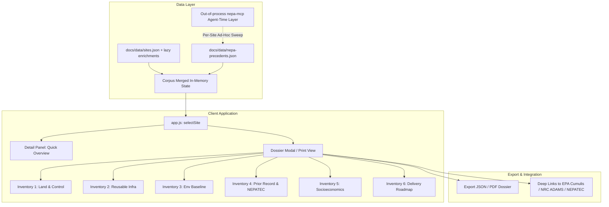

# Spec 01: Single-Site Comprehensive Reuse Dossier & Industrial Precedent Engine

**Status:** Proposed  
**Priority:** High (Impact: 5/5, Size: 3/5, Completeness: 4/5)  
**Target Version:** v1.13.0  
**Lead Component:** `docs/app.js`, `connectors/nepa_precedent.py`, `docs/dossier.js`, `docs/style.css`

---

## 1. Executive Summary & Value Proposition

Currently, the Brownfield Opportunities platform excels at high-throughput multi-criteria screening across 46,759 sites using 5 distinct scoring lenses (Data Centers, Power Generation, Nuclear/AP1000 Siting, Advanced Manufacturing, Microreactors). However, once a developer or agency discovers a high-scoring site, they must manually assemble disparate records regarding title, environmental baselines, transferable permits, historical NEPA reviews, and agency jurisdictions.

This initiative delivers a **Single-Site Comprehensive Reuse Dossier** coupled with an **Industrial Precedent Engine** powered by PNNL's NEPATEC (NEPA Text Corpus) and PermitAI methodologies. For any selected site in the corpus, the platform dynamically compiles a 6-inventory decision package:
1. **Land & Title Control** (Acreage, parcel boundaries, ownership history, institutional controls, FUDS/BRAC property categories).
2. **Reusable Infrastructure** (Interconnect voltage, switchyard proximity, rail spurs, natural gas pipelines, existing thermal/hydrological assets).
3. **Environmental Baseline** (FEMA NFHL flood zones, FEMA NRI multi-hazard ratings, climate risk, tribal consultation context, EPA cleanup milestones).
4. **Regulatory & Permitting History** (Superfund Record of Decision (ROD) summaries, ECHO NPDES permits, Title V air history, historical NEPA precedent).
5. **Workforce & Community Economics** (IRA Energy Community status, Opportunity Zones, state tax incentive tier, local labor availability).
6. **Delivery & Pre-Application Roadmap** (Lead federal/state agencies, required consultation pathways under ESA Section 7 and NHPA Section 106, estimated permitting lead times).

---

## 2. Architecture & Data Flow



### 2.1 Static-First Invariant
- The core dossier is assembled 100% in-browser from already-loaded and lazy-loaded enrichment payloads (`infra-proximity.json`, `parcel-owner.json`, `epa-echo.json`, `epa-superfund-docs.json`, `ira-energy-community.json`, `opportunity-zone.json`, `tribal-context.json`).
- Precedent analogues are stored in an indexed, compressed static JSON (`docs/data/nepa-precedents.json`, ~150KB) linking historical coal, industrial, and federal site redevelopments to CEQ NEPA project IDs, EIS/EA document URLs, challenged procedural nodes, and mitigation outcomes.

---

## 3. Data Schema & Contracts

### 3.1 Python Precedent Schema (`schema.py`)

```python
class NepaPrecedentRecord(BaseModel):
    model_config = ConfigDict(extra="forbid")
    
    project_id: str = Field(description="CEQ or Agency NEPA Project ID")
    title: str = Field(description="Action title (e.g. 'Homer City Energy Center Repowering')")
    agency: str = Field(description="Lead Federal Agency (DOE, DOD, USACE, NRC, BLM, EPA)")
    review_level: Literal["EIS", "EA", "CE", "CatEx"] = Field(description="NEPA Review Level")
    reuse_category: Literal["coal_to_nuclear", "coal_to_datacenter", "brownfield_mfg", "mine_repowering", "defense_reuse"]
    year: int = Field(ge=1970, le=2030)
    state: str = Field(min_length=2, max_length=2)
    reused_assets: list[str] = Field(default_factory=list, description="List of physical assets reused (e.g. switchyard, intake)")
    procedural_challenges: list[str] = Field(default_factory=list, description="PermitTEC/court challenge nodes if any")
    mitigation_measures: list[str] = Field(default_factory=list, description="Key environmental mitigation measures adopted")
    source_url: str = Field(description="Direct URL to NEPATEC / Federal Register document")
    citation: str = Field(description="Standardized academic/legal citation")
```

### 3.2 Dossier UI State Contract (`dossier.js`)

```typescript
interface SiteDossier {
  site: SiteRecord;
  completeness_pct: number;
  inventories: {
    land: {
      reported_acres: number | null;
      parcel_acres: number | null;
      owner: string | null;
      owner_type: 'private' | 'municipal' | 'state' | 'federal' | 'tribal' | 'unknown';
      institutional_controls: boolean;
      rau_ready: boolean;
    };
    infrastructure: {
      effective_grid_mi: number;
      grid_source: 'line' | 'substation';
      substation_kv: number | null;
      rail_mi: number | null;
      gas_mi: number | null;
      highway_mi: number | null;
      nearby_plants: Array<{ name: string; mw: number; fuel: string; status: 'active' | 'retired' | 'planned_retirement' }>;
    };
    environmental: {
      flood_zone: string;
      in_sfha: boolean;
      nri_risk_rating: string;
      wildfire_risk: string;
      drought_risk: string;
      climate_zone: string;
      tribal_consultation_context: string[];
    };
    regulatory: {
      superfund_status: string | null;
      documents_count: number;
      has_npdes: boolean;
      echo_violations_5yr: number;
      applicable_nepa_precedents: NepaPrecedentRecord[];
    };
    socioeconomic: {
      in_energy_community: boolean;
      in_opportunity_zone: boolean;
      state_incentive_tier: number;
      state_regulatory_climate: 'supportive' | 'neutral' | 'cautionary' | 'restrictive';
      construction_workforce_est: string;
      // 2026-08 additions (industry sweep T3/T4): the community-context signals that
      // now decide hearings — local moratorium/pause activity, utility DC rate class
      // (e.g. TVA's Oct-2026 data-center tariff), and the "already-disturbed land, no
      // farmland taken" positioning line for brownfield reuse.
      local_moratorium_context: string | null;
      utility_dc_tariff_context: string | null;
    };
  };
}
```

**Precedent-pace attribute (2026-08):** NEPA review *duration* is now a competitive variable — the
administration committed to a 7-month full federal review for the OpenAI–Nvidia Ohio gas project
(Heatmap, Aug 2026). `NepaPrecedentRecord` should carry `review_months: int | null` so the
precedent engine can answer "how fast have comparable actions actually cleared," not just "what was
decided."

---

## 4. UI/UX Implementation & DOM Budget

1. **Dedicated View & Modal Flow**:
   - Clicking **"Generate Reuse Dossier"** in the detail panel opens an interactive, responsive full-screen dossier view or slide-over drawer (`.site-dossier-modal`).
   - Built **lazily on demand** so it consumes **0 DOM nodes** on first paint, preserving the repository's strict <5,000 first-paint node budget.
2. **Print & Export Layout**:
   - Styled with `@media print` rules allowing single-click PDF generation formatted as an institutional executive briefing (2-page executive summary + appendix).
3. **Precedent Analogue Cards**:
   - Shows top 3 matching historical NEPA reviews for the site's reuse category with exact page citations and outcome metrics.

---

## 5. Verification & Test Plan

- **Unit Tests (`tests/test_nepa_precedents.py`)**:
  - Assert all precedent records validate against `NepaPrecedentRecord`.
  - Verify every source URL is an accessible HTTPS endpoint.
- **E2E Playwright Tests (`tests/e2e/test_site_dossier.py`)**:
  - Verify clicking "View Dossier" for Superfund, ACRES, FUDS, and BRAC records populates all 6 inventory blocks without JavaScript errors.
  - Verify lazy DOM allocation (modal destroyed/unmounted on close).
  - Verify print CSS stylesheet loads and formats headers cleanly.
---

## NEPA-MCP expansion (2026-08-24)

The Hanford tab (Spec 11) is now the shipped prototype of exactly this
dossier: curated ground truth + ten-source screen + pathway table + corpus
joins + nearby tracked records, for nine land units of one site. What it
proves for THIS spec:

- **The dossier's environmental-baseline inventory is one engine call.**
  `scripts/nepa_screening.py` (Spec 10) turns "assemble the screen for site
  X" into a cached, rate-limited, failure-isolated batch — the per-site
  Tier-A flow no longer needs an analyst driving MCP tools by hand.
- **The precedent half has a GIS complement.** Map Composer's
  `eis_boundaries` layer (EPA-registered EIS project boundaries, in every
  Hanford package) answers "what NEPA reviews happened NEAR here"
  geometrically, before NEPATEC answers "what did analogous reviews SAY."
  The dossier should render both: boundary hits → NEPATEC text pulls.
- **Fit vocabulary to reuse:** the Hanford opportunity model
  (`anchored/strong/conditional/precluded` + cited rationale) is the
  editorial layer this spec's §6 decision package needs — and `precluded`
  is the load-bearing value; a dossier that only says yes is an ad.
