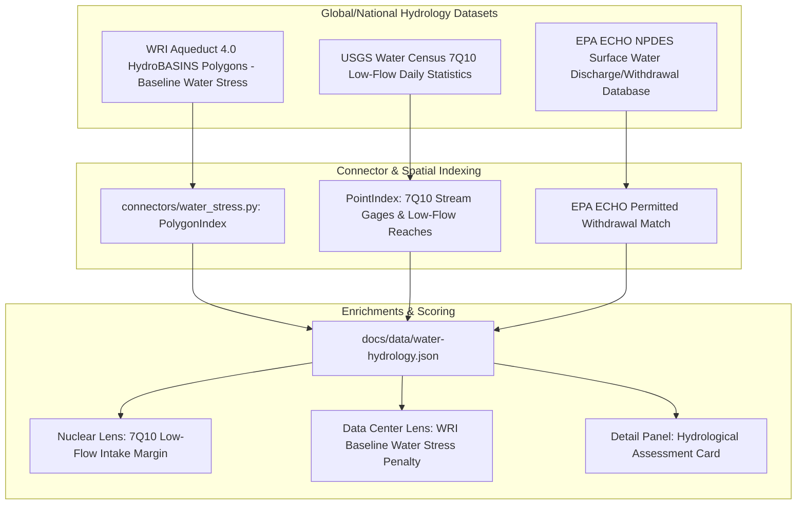

# Spec 05: Water Stress, Consumptive Cooling Availability & 7Q10 Low-Flow Framework (WRI Aqueduct 4.0 + USGS Water Census)

**Status:** Proposed  
**Priority:** High (Impact: 5/5, Size: 3/5, Completeness: 4/5)  
**Target Version:** v1.14.0  
**Lead Component:** `connectors/water_stress.py`, `docs/ap1000-score.js`, `docs/dc-score.js`

---

## 1. Executive Summary & Value Proposition

Water availability has emerged alongside power availability as the **#2 physical constraint** for both large-scale power generation (nuclear/fossil thermal cycles) and hyperscale data center operations. 
- A standard 1,117 MWe AP1000 nuclear reactor requires approximately **25,000 to 35,000 gpm** (~55–80 cfs) of consumptive water for evaporative cooling towers.
- A 100 MW direct-evaporative or hybrid-cooled AI data center consumes **300,000 to 1,000,000 gallons per day** of municipal or raw water.
- Across major data center hubs (e.g. Phoenix, Northern Virginia, Dallas, Salt Lake City), local water utilities and municipal boards are increasingly enacting moratoriums or requiring closed-loop/air-cooled architectures that impose severe capital and efficiency (PUE) penalties.

Currently, our platform captures only a high-level county-wide FEMA NRI drought rating. This initiative implements a granular, physically defensible hydrological framework combining **WRI Aqueduct 4.0 HydroBASINS baseline water stress** and **USGS Water Census 7Q10 low-flow stream statistics**.

---

## 2. Hydrological Data Sources & Pipeline



### 2.1 Technical Specifications

1. **WRI Aqueduct 4.0 HydroBASINS**:
   - Watershed polygons at HydroBASINS Level 6 / Level 8 (~16,000 polygons for CONUS).
   - Metrics: **Baseline Water Stress (BWS)** (ratio of total water withdrawals to available renewable surface and groundwater supplies: Low $<10\%$, Low-Medium $10\text{--}20\%$, Medium-High $20\text{--}40\%$, High $40\text{--}80\%$, Extremely High $>80\%$).
   - Interflow depletion and groundwater table decline indicators.
2. **USGS 7Q10 Streamflow Statistics**:
   - Lowest 7-day average flow that occurs with a 10-year recurrence interval.
   - For river-adjacent candidate sites, computes the **Intake Fraction Margin**:
     $$\text{Margin}_{7\text{Q}10} = \frac{\text{Flow}_{7\text{Q}10} - \text{Demand}_{\text{consumptive}}}{\text{Flow}_{7\text{Q}10}}$$

---

## 3. Data Schema & Contracts

### 3.1 Python Data Schema (`schema.py`)

```python
class WaterHydrologyRecord(BaseModel):
    model_config = ConfigDict(extra="forbid")
    
    site_id: str
    watershed_id: str = Field(description="HydroBASINS / HUC-8 ID")
    watershed_name: str
    baseline_water_stress_score: float = Field(ge=0.0, le=5.0, description="WRI BWS score 0.0 to 5.0")
    water_stress_category: Literal["low", "low_medium", "medium_high", "high", "extremely_high"]
    drought_risk_score: float = Field(ge=0.0, le=5.0)
    groundwater_depletion_trend: Literal["stable", "declining", "severely_depleted"]
    nearest_river_name: Optional[str] = None
    nearest_river_mi: Optional[float] = None
    river_7q10_flow_cfs: Optional[float] = None
    dry_cooling_required: bool = Field(description="True if water stress or low-flow forbids wet cooling towers")
```

---

## 4. Scoring Algorithm & Penalties

### 4.1 Data Center Lens Water Stress Penalty (`dc-score.js`)
Hyperscale data center scoring subtracts points for extreme water stress, reflecting municipal permitting friction and increased CapEx for air-cooled chillers:

$$\text{Penalty}_{\text{water\_stress}} = \begin{cases}
0 & \text{if } \text{BWS} \le 1.0 \text{ (Low)} \\
-2 & \text{if } 1.0 < \text{BWS} \le 2.0 \text{ (Low-Medium)} \\
-5 & \text{if } 2.0 < \text{BWS} \le 3.0 \text{ (Medium-High)} \\
-9 & \text{if } 3.0 < \text{BWS} \le 4.0 \text{ (High)} \\
-14 & \text{if } \text{BWS} > 4.0 \text{ (Extremely High)}
\end{cases}$$

### 4.2 Nuclear / AP1000 Low-Flow Intake Scoring (`ap1000-score.js`)
For reactor sizing, the 20-point cooling water component is directly modulated by the 7Q10 flow margin:

$$\text{Score}_{\text{cooling}} = \begin{cases}
20.0 \times \min\left(1.0, \frac{\text{Flow}_{7\text{Q}10}}{500 \text{ cfs}}\right) & \text{if river-adjacent} \\
12.0 & \text{if lake / reservoir with confirmed storage} \\
6.0 & \text{if dry/hybrid cooling required (BWS High/Extremely High)}
\end{cases}$$

---

## 5. UI/UX Components

- **Detail Panel "Water & Hydrology" Card**:
  - Displays WRI Water Stress Level with official WRI color scale (blue $\to$ yellow $\to$ orange $\to$ dark red).
  - Displays nearest major watercourse, distance, and estimated 7Q10 flow.
  - Indicates wet cooling vs. dry cooling engineering feasibility.
- **Map Filter**:
  - Filter toggle: **"💧 Low Water Stress Only (BWS < 20%)"**.

---

## 6. Verification & Test Plan

- **Spatial Tests (`tests/test_water_stress.py`)**:
  - Test known desert sites (e.g. Phoenix, Las Vegas) resolve to `extremely_high` ($\text{BWS} > 4.0$).
  - Test known high-water eastern river sites (e.g. TVA Tennessee River, Columbia River) resolve to `low` or `low_medium` with high 7Q10 flow.
- **E2E Playwright Tests (`tests/e2e/test_water_ui.py`)**:
  - Verify detail panel displays water stress meter and citations without layout shift.
