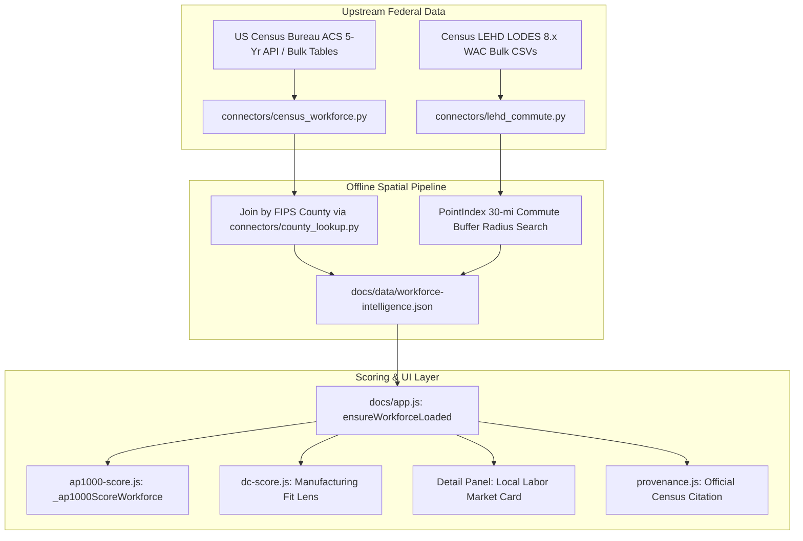

# Spec 02: Quantitative Workforce & Socioeconomic Intelligence Layer (Census ACS + LEHD/LODES)

**Status:** Proposed  
**Priority:** High (Impact: 5/5, Size: 3/5, Completeness: 5/5)  
**Target Version:** v1.13.0  
**Lead Component:** `connectors/census_workforce.py`, `connectors/lehd_commute.py`, `docs/ap1000-score.js`, `docs/dc-score.js`

---

## 1. Executive Summary & Value Proposition

In the current codebase, the Nuclear/AP1000 Siting lens assigns **15 out of 100 points** to "Construction Workforce," and the Advanced Manufacturing lens explicitly notes that workforce availability is the primary missing quantitative factor. Currently, this dimension relies on subjective analyst ratings (`strong` / `good` / `moderate` / `limited`), which the project documentation candidly notes has *"no federal GIS layer"*.

This specification establishes a pure-Python, zero-C-dependency, bulk-cached workforce intelligence connector combining:
1. **Census ACS 5-Year County Socioeconomics** (County labor force size, construction trade employment counts, manufacturing employment counts, median household income).
2. **Census LEHD/LODES (Longitudinal Employer-Household Dynamics / Origin-Destination Employment Statistics)** Work Area Characteristics (WAC) data within a 30-to-45-mile commute catchment of every site using pure-Python `PointIndex` and `CountyIndex`.

This replaces hand-curated adjectives with verifiable federal statistical data across all 46,759 sites.

---

## 2. Architecture & Data Strategy



### 2.1 Technical Constraints & Performance Safeguards
- **Zero Per-Site HTTP**: We download statewide county summaries (3,232 counties) in 52 requests total (1 per state + DC + PR) rather than querying Census per site.
- **Offline Spatial Join**: Sites join to their pre-resolved county FIPS from `connectors/county_lookup.py` in <5 milliseconds for the entire 46,759 corpus.
- **Compressed Output Payload**: `docs/data/workforce-intelligence.json` is compressed and quantized to emit only essential numeric metrics (~380 KB gzip).

---

## 3. Data Schema & Contracts

### 3.1 Python Schema (`schema.py`)

```python
class WorkforceRecord(BaseModel):
    model_config = ConfigDict(extra="forbid")
    
    county_fips: str = Field(min_length=5, max_length=5, description="5-digit FIPS code (SSCCC)")
    county_name: str
    state: str = Field(min_length=2, max_length=2)
    labor_force_total: int = Field(ge=0, description="Total civilian labor force")
    construction_trades_count: int = Field(ge=0, description="Employed in construction / extraction trades (SOC 47-0000)")
    manufacturing_workforce_count: int = Field(ge=0, description="Employed in manufacturing sectors (NAICS 31-33)")
    median_household_income: int = Field(ge=0, description="ACS 5-yr median household income in USD")
    labor_surplus_rate: float = Field(ge=0.0, le=100.0, description="County unemployment rate %")
    workforce_source: str = Field(default="US Census ACS 5-Year (2020-2024)")
    verified_at: str = Field(pattern=r"^\d{4}-\d{2}-\d{2}$")
```

### 3.2 Site Record Enrichment Schema

```python
# SiteRecord additions:
county_labor_force: Optional[int] = None
county_construction_employment: Optional[int] = None
county_manufacturing_employment: Optional[int] = None
county_median_income: Optional[int] = None
workforce_rating_derived: Optional[Literal["tier_1_hub", "tier_2_strong", "tier_3_moderate", "tier_4_rural"]] = None
```

---

## 4. Mathematical Formulation & Scoring Integration

### 4.1 Nuclear / AP1000 Workforce Formulation (`ap1000-score.js`)

The legacy 15-point workforce term:
$$\text{Score}_{\text{WF, legacy}} = \begin{cases} 15 & \text{if 'strong'} \\ 10 & \text{if 'good'} \\ 5 & \text{if 'moderate'} \\ 0 & \text{if 'limited'} \end{cases}$$

Replaced by a continuous log-scaled index of construction and heavy-trade labor pool within the county/commute shed:

$$\text{Index}_{\text{trade}} = \log_{10}(\max(\text{construction\_trades\_count}, 100))$$

$$\text{Score}_{\text{WF, continuous}} = \text{clamp}\left( 15 \times \frac{\text{Index}_{\text{trade}} - \log_{10}(500)}{\log_{10}(25{,}000) - \log_{10}(500)}, 0, 15 \right)$$

*Calibration Anchors:*
- $\ge 25,000$ construction workers (major industrial metro) = 15.0 pts (Full credit)
- $5,000$ construction workers (regional industrial hub) = 10.5 pts
- $1,500$ construction workers (small metro) = 6.3 pts
- $\le 500$ construction workers (isolated rural) = 0.0 pts

### 4.2 Manufacturing Fit Lens Formulation (`dc-score.js`)

Integrates manufacturing density into the Manufacturing Lens (replacing flat readiness placeholder with a 15-point labor factor):
$$\text{Score}_{\text{mfg\_labor}} = \text{clamp}\left( 15 \times \frac{\log_{10}(\max(\text{mfg\_count}, 200)) - \log_{10}(200)}{\log_{10}(50{,}000) - \log_{10}(200)}, 0, 15 \right)$$

---

## 5. UI/UX Integration

- **Detail Panel**: Adds a dedicated **"Labor Market & Trades"** tile:
  - Total regional labor force (formatted with thousands separators).
  - Construction & specialized trades headcount with a percentile indicator against national counties.
  - Manufacturing base density.
- **Rankings Table**: Supports sorting by **Construction Trades** and **Manufacturing Labor** in the Advanced Manufacturing and Nuclear tabs.
- **Data Provenance**: Registers table `B24010` (Sex by Occupation for the Civilian Employed) and `DP03` (Selected Economic Characteristics) in `provenance.js`.

---

## 6. Verification & Test Plan

- **Connector Unit Tests (`tests/test_census_workforce.py`)**:
  - Verify all 50 states + PR resolve clean FIPS mappings.
  - Verify zero empty payload writes on API throttling.
- **Scoring Property Tests (`tests/test_workforce_scoring.py`)**:
  - Test monotonicity: higher trade count strictly yields $\ge$ score.
  - Test boundary behavior: 0 workers yields 0.0 score without division-by-zero.
- **E2E Browser Tests (`tests/e2e/test_workforce_ui.py`)**:
  - Verify detail panel displays accurate census statistics for sampled sites (e.g. Redstone Arsenal vs Fort Wainwright).
